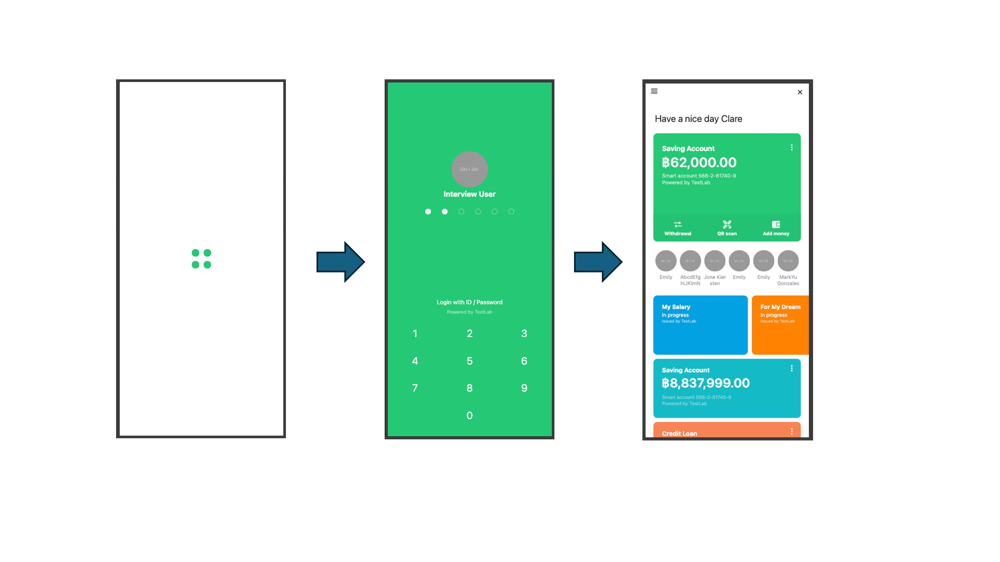

# Fullstack KLine



## Stack
**Database**
- mysql
  
**Backend**
- Golang
- gin
- gorm

**Frontend**
- React

## Folder Structure
**Backend**
```sh
├── Dockerfile #  Docker for build and run app server
│ 
├── Makefile # cmd to run script ex: `make dev` for run go in local
│ 
├── cmd # initial API server ex: gin web api
│ 
├── config # load config from env
│ 
├── db # initial and manage database
│   ├── db.go
│   ├── migrations
│   ├── mysql-config
│   ├── seeds
│ 
├── docs # API document ex: swagger
│   
├── go.mod # golang dependencies
├── go.sum # golang dependencies log
│ 
├── internal 
│   ├── domain # models of data
│   ├── handler # parts of manage data from api before go to usecase
│   ├── middleware # middleware to watch before
│   ├── module # register api route 
│   ├── repository # parts of communicate with database
│   └── usecase # parts of logic
│ 
├── main.go # main
│ 
├── pkg # ex: utils
│ 
└── scripts 
    └── migrate_and_seed.sh # script for db migration
```

**Frontend**
```sh
├── Dockerfile # Docker for build and deploy website
├── eslint.config.js
├── index.html
├── package-lock.json
├── package.json
├── public
│   └── vite.svg
├── src
│   ├── App.tsx # Core for setup React
│   ├── api # API manage management
│   │  
│   ├── assets # Image, Fonts, ...
│   │   
│   ├── index.css
│   ├── main.tsx # Initial React in html DOM
│   ├── pages # All page in website
│   │   
│   ├── types # Type to using in typescript
│   │    
│   ├── utils # Utility
│   │   
│   └── vite-env.d.ts
├── tsconfig.app.json
├── tsconfig.json
├── tsconfig.node.json
└── vite.config.ts
```

## Setup step for demo

1. Clone the repository `https://github.com/kittichanr/fullstack-kline.git`
2. Open the project and run docker compose for build and instance docker all we need. `docker-compose up --build`
3. Migrate database
   1. Unzip seeds file in path `backend/db/seeds.zip`
   2. Go to backend directory `cd backend`
   3. Run bash script for migration database `scripts/migrate_and_seed.sh` **Note: It takes about a while.**
4. Check website and server are running correctly with open
   1. `http://localhost:3000/` for web
   2. `http://localhost:8080/swagger/index.html#/` for server
5. Step to play the use case flow
   1. firstly, we need to set pin in user data. for the demo I will use this ID to play `000018b0e1a211ef95a30242ac180002`
      1. set pin by call api `/api/set-pin`

      ```sh
      curl -X 'POST' \
        'http://localhost:8080/api/set-pin' \
        -H 'accept: application/json' \
        -H 'Content-Type: application/json' \
        -d '{
        "name": "User_000018b0e1a211ef95a30242ac180002",
        "pin": "123456"
      }'
      ```

      2. After set pin go to website  `http://localhost:3000/` to fill name and pin for go to main bank page.
         1. name: `User_000018b0e1a211ef95a30242ac180002`
         2. pin: `123456`
      3. Now you will see the main bank page of this user.
      4. Enjoy!
   2. If you want to try another user for going in main bank page. you can get more user id in database to set pin first and then go verify name and pin of that user in website.
      1. database (local) login to get another user to play.
         1. database: `kline` 
         2. host: `localhost`
         3. port: `3306`
         4. user: `root`
         5. password: `password`

## API Spec 

In this project we use swagger to store API spec you can see it in `http://localhost:8080/swagger/index.html#/` after instance server container from docker compose.


